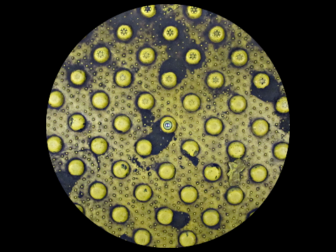
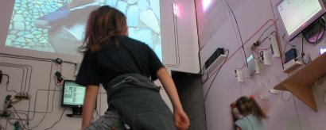
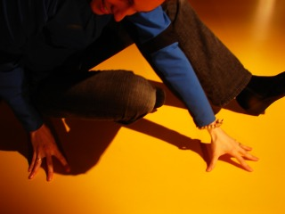
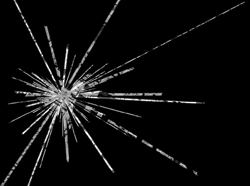
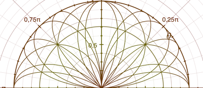
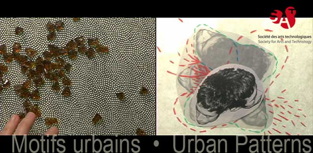

Intentions
==========

Biographie
----------

Alexandre Quessy est un artiste-programmeur montréalais qui s'intéresse à l'échantillonnage d'images, de sons et de données électroniques. Il s'implique activement dans la création de logiciels libres pour les arts et dans leur enseignement. Ses projets ont été présentés au Canada, aux États-Unis, en Norvège, en France, au Mexique et à Taiwan. Il est l'auteur principal du logiciel d'animation en direct Toonloop. Il est directeur du développement logiciel à la Société des arts technologiques. (SAT)

Photo du sol d'une station de métro à New York.

Résumé
------

*Marche sonore dans Orléans* est une installation qui invite à la contemplation de paysages sonores contrastants, comme des sons industriels, des sons naturels et des sons humains. C'est l'occasion de constater à quel point les sons qui nous entourent peuvent varier dans leur caractère, leur timbre, leur rythme et leur spectre. Ainsi, des sons très harmonieux cohabitent avec des sons des plus discordants, voire même violents. 

L'écoute de tels paysages sonores peut favoriser le recueillement. Parfois, il peut être amusant d'observer le quotidien des gens, ce qui nous donne un peu de recul face à notre condition humaine. Le fait d'écouter des sons familiers à travers un dispositif de reproduction sonore spatialisée peut nous donner des perspectives nouvelles par rapport à ces sons, car nous leur tendons l'oreille d'une manière inouïe.

L'artiste souhaite de plus souligner que le choix des lieux sonores présentés est teinté de la subjectivité propre à ce voyageur étranger qui découvre encore une fois les paysages sonores de la France. Cette oeuvre présente donc un regard spécifique sur un ensemble de lieux présentant différents paysages sonores, et ainsi donc également sur le quotidien des gens qui y vivent et le visitent.

Dans cette installation sonore, Alexandre Quessy propose aux visiteur de se ballader dans des paysages sonores enregistrés dans la région d'Orléans. Les visiteurs peuvent choisir eux-même ce qu'ils souhaitent écouter, simplement en se déplaçant à l'intérieur du périmètre d'écoute.
Cette oeuvre prendra probablement la forme d'une installation sonore interactive dans laquelle les visiteurs peuvent choisir un ou plusieurs sons à écouter selon l'endroit où ils se trouvent. L'espace représente ainsi une carte à l'échelle d'Orléans. Là où l'on marche, on peut entendre le paysage sonore qui s'y trouve. On peut également voir au sol l'image du sol à l'endroit de chaque lieu de prise de son.

Ainsi, l'artiste invite les visiteurs à entendre la région sous l'angle de son écoute à lui, c'est à dire celle d'un voyageur québécois pour qui le patrimoine millénaire dont témoignent les murs européens est très impressionnant. En effet, pour un nord-américains, vivre au milieu des immeubles centenaires est des plus exotiques. Au Canada, les rues sont larges et forment des quadrilatères prévisibles, mais ne sont pas autant les témoins de chemins qu'empruntaient autrefois des vaches, par exemple. De la même manière, les briques en Europe sont si belles, car elles sont disposées de manière artisanales il y a déjà des centaines d'années.

Écouter un paysage sonore au moyen d'un dispositif de reproduction, c'est une invitation à porter attention à des détails qui passent souvent inaperçus au quotidien, lorsque nous entendons le monde directement, mais sans trop l'écouter. Ainsi, on peut découvrir des détails qui sont parfois très intéressants et poétiques.

L'artiste prévoit se ballader dans la région orléanaise du 7 au 31 juillet 2011 afin de faire des prises de son. 

Historique
----------

Alexandre Quessy s'intéresse l'échantillonnage depuis environ 2003, année durant laquelle il a découvert le logiciel Pure Data. Il était alors déjà formé à la musique classique et à l'improvisation dramatique, choses qui selon lui sont intimement liées aux arts basés sur le temps.

En 2006, Quessy a participé au développement de la plateforme CRASlab au CRAS à Main d'Oeuvres. Ce fût là son premier contact avec la spatialisation sonore. 

En 2007, Quessy a  créé le tapis musical (Human Sequencer) dans lequel les visiteurs étaient invités à jouer avec des échantillons sonores sur un séquenceur géant et dans lequel les sons étaient également spatialisés.

En 2008, Quessy a servi d'accompagnateur d'artiste pour James Partaik, artiste sonore canadien, pour son oeuvre Transects sonores. Dans ce projet, Partaik a fait des séries d'enregistrement de paysages sonores selon des trajectoires rectilignes, non contraintes par le quadrillage des rues et des immeubles. Ce projet fût pour Quessy l'occasion de devenir plus confiant avec les techniques de reproduction sonore Ambisonic. Ce fût aussi pour lui l'occasion d'expérimenter combien il peut être agréable de faire des prises de sons de paysages sonores, puis d'écouter ces sons dans un contexte de reproduction multicanal.

Plus tard, en 2009, Quessy a suivi un atelier sur la production sonore en 3D avec Ambisonic avec Daniel Courville à Oboro. Il a alors créé les abstractions ambi.* dans la librairie PdMtlAbstractions.

Également en 2009, Quessy a présenté Motifs urbains, avec Isabelle Caron, une performance sur les trajets que l'on trace chaque jour dans la ville que l'on habite. Dans cette oeuvres, des paysages sonores de la ville de Montréal accompagnaient la création d'une animation image par image transmise en réseau. 

Aujourd'hui, Quessy est directeur du développement logiciel à la SAT et prévoit développer une série de greffons Ambisonic pour Pyo. Ensuite, le plan est d'intégrer tout ça à la librairie SpatOSC, développée à la SAT.

Devis technique
---------------

L'oeuvre sera réalisée uniquement avec des logiciels libres, à savoir soit Pure Data, soir Pyo pour le rendu sonore. La détection se fera probablement avec la Kinect ou avec un caméra Web et OpenCV.

Les matériaux utilisés dans l'installation sont:
 * ordinateur
 * carte de son
 * amplificateur
 * haut-parleurs
 * caméra
 * projecteur vidéo

Pour l'échantillonnage, l'artiste utilise:
 * micro quadraphonique (Zoom H2)
 * caméra photo (?)
 * GPS et boussole
 * carnet de notes

