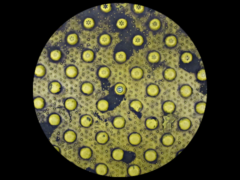

Intentions
==========

Résumé
------

Zone touristique: installation sonore sur l'alterité, sur le fait d'être étranger, invitant à la contemplation et l'introspection.

Dans cette installation sonore, Alexandre Quessy propose aux visiteur de se ballader dans des paysages sonores enregistrés dans la région d'Orléans. Ainsi, l'artiste invite les visiteurs à entendre la région sous l'angle de son écoute à lui, c'est à dire celle d'un voyageur québécois pour qui le patrimoine millénaire dont témoignent les murs européens est très impressionnant.

En effet, pour un nord-américains, vivre au milieu des immeubles centenaires est des plus exotiques. Au Canada, les rues sont larges et forment des quadrilatères prévisibles, mais ne sont pas autant les témoins de chemins qu'empruntaient autrefois des vaches, par exemple. De la même manière, les briques en Europe sont si belles, car elles sont disposées de manière artisanales il y a déjà des centainres d'années.

Écouter un paysage sonore au moyen d'un dispositif de reproduction, c'est une invitation à porter attention à des détails qui passent souvent inaperçus au quotidien, lorsque nous entendons le monde directement, mais sans trop l'écouter. Ainsi, on peut découvrir des détails qui sont parfois très intéressants et poétiques.

L'artiste s'intéresse à la mise en relation de paysages sonores contrastants, comme des sons industriels, des sons naturels et des sons humains. 

Sur le plan formel, cette oeuvre prendre probablement la forme d'une installation sonore interactive dans laquelle les visiteurs peuvent choisir un ou plusieurs sons à écouter selon l'endroit où ils se trouvent. L'espace représente ainsi une carte à l'échelle d'Orléans. Là où l'on marche, on peut entendre le paysage sonore qui s'y trouve. On peut également voir au sol l'image du sol à l'endroit de chaque lieu de prise de son.

L'artiste prévoit se ballader dans la région orléanaise du 7 au 31 juillet 2011 afin de faire des prises de son. 

Devis technique
---------------

L'oeuvre sera réalisée uniquement avec des logiciels libres, à savoir soit Pure Data, soir Pyo pour le rendu sonore. La détection se fera probablement avec la Kinect ou avec un caméra Web et OpenCV.

Les matériaux utilisés dans l'installation sont:
 * ordinateur
 * carte de son
 * amplificateur
 * haut-parleurs
 * caméra
 * projecteur vidéo

Pour l'échantillonnage, l'artiste utilise:
 * micro quadraphonique (Zoom H2)
 * caméra photo (?)
 * GPS et boussole
 * carnet de notes

Biographie
----------

Alexandre Quessy est un artiste-programmeur montréalais qui s'intéresse à l'échantillonnage d'images, de sons et de données électroniques. Il s'implique activement dans la création de logiciels libres pour les arts et dans leur enseignement. Ses projets ont été présentés au Canada, aux États-Unis, en Norvège, en France, au Mexique et à Taiwan. Il est l'auteur principal du logiciel d'animation en direct Toonloop. Il est directeur du développement logiciel à la Société des arts technologiques. (SAT)

